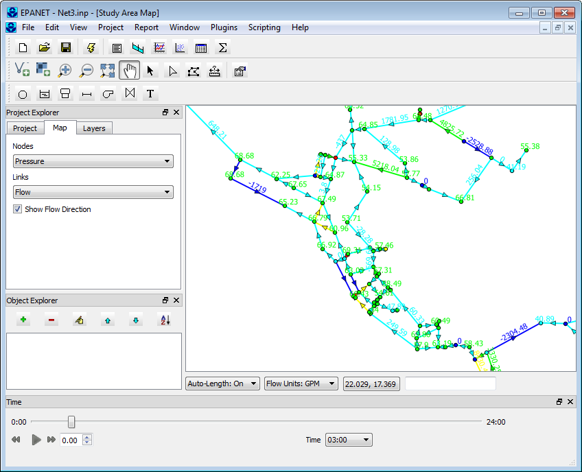

# SWMM-EPANET_User_Interface

# EPA Dislaimer

*The United States Environmental Protection Agency (EPA) GitHub project code is provided on an "as is" basis and the user assumes responsibility for its use. EPA has relinquished control of the information and no longer has responsibility to protect the integrity, confidentiality, or availability of the information. Any reference to specific commercial products, processes, or services by service mark, trademark, manufacturer, or otherwise, does not constitute or imply their endorsement, recommendation or favoring by EPA. The EPA seal and logo shall not be used in any manner to imply endorsement of any commercial product or activity by EPA or the United States Government.*

# Archive

Please note that this github site is archived as the project is no longer active.  You may clone from this github site but you may not push changes or open tickets.

User interfaces for EPA SWMM and EPANET models implemented with:

* python: 3.6.0
* pyqt5: 5.9.0
* pyqgis3: 3.0.3-Girona

* doc: documentation
* src: source code
* test: automated tests and interactive user interface tests
